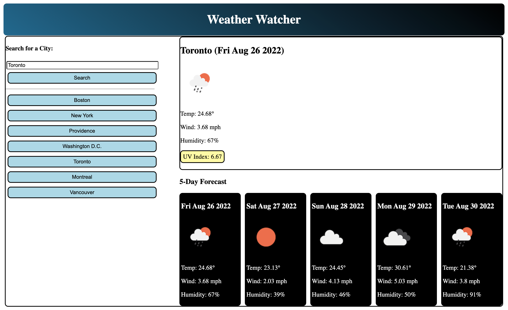

# Weather Watcher

## Description
Weather Watcher is a dashboard that displays current and five-day weather forecasts.  The user types in the city of their choice and upon clicking the search button, textual data is displayed for the date, temperature, wind speed, and humidity.  Accompanying icons are used to depict visible conditions such as sun, rain, and cloud cover.

## Additional Features
The snapshot of the current weather also features the UV index with a color-coded scheme to indicate whether conditions are favorable (green = below 3), moderate (yellow = below 8), or severe (red = above 8).  Once search results have been generated, buttons for individual cities are created and relevant data is added to local storage.  The user can click on any of these buttons at a future point to retrieve a particular city's updated information.

## Tools/Technologies
HTML 
CSS 
JavaScript 
Moment.js 
Local storage

## Acknowledgement
An OpenWeather API key was generated for this non-commercial application.  
N.B.: Bootcamp study project

https://raposamillar.github.io/weather-watcher/

